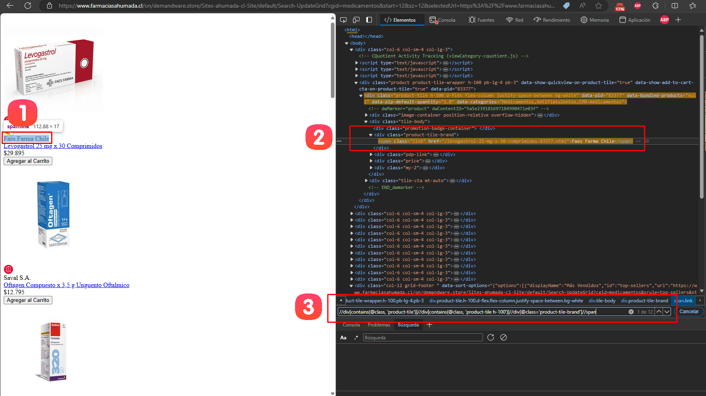

# Documentación del Spider de Ahumada

## Resumen
Este spider está diseñado para extraer información de productos del sitio web de Farmacias Ahumada (farmaciasahumada.cl). Utiliza Scrapy y Selenium para navegar por el sitio y extraer datos de los productos.

## Paso 1: Configuración Inicial y Definición de Categorías

### 1.1 Configuración del Navegador
El spider comienza configurando el navegador Chrome en modo headless:

```python
def __init__(self, *args, **kwargs):
    super().__init__(*args, **kwargs)
    chrome_options = Options()
    chrome_options.add_argument("--headless")
    service = Service(ChromeDriverManager().install())
    self.driver = webdriver.Chrome(service=service, options=chrome_options)
```

### 1.2 Definición de Categorías
Las categorías a scrapear se definen manualmente en el código del spider. Este proceso se realiza siguiendo estos pasos:


1. **Acceder al menú de categorías**: 
   - Visitar la página principal de Farmacias Ahumada.
   - Hacer clic en el menú principal para desplegar las categorías.

2. **Inspeccionar el DOM**:
   - Abrir las herramientas de desarrollador del navegador (F12 o clic derecho -> Inspeccionar).
   - Localizar la lista de categorías en el HTML.

3. **Identificar la estructura de las categorías**:
   - Las categorías se encuentran dentro de una etiqueta `<ul>`.
   - Cada categoría está en un `<li>` que contiene un enlace `<a>`.
   - El enlace `<a>` tiene un atributo `id` que nos interesa.

Basándonos en esta inspección, las categorías se definen en el código de la siguiente manera:

```python
self.categories = [
    'medicamentos',
    'belleza',
    'higiene-y-cuidado-personal',
    'dermocosmetica',
    'vitaminas-y-suplementos',
    'infantil-y-maternidad',
    'dispositivos-medicos',
    'bebidas-y-alimentos',
    'mundo-mascota',
    'recetario-magistral'
]
```

Estas categorías corresponden a los `id` de los enlaces encontrados en la inspección del DOM.

## Paso 2: Iniciando el Proceso de Scraping

El spider comienza visitando la página principal de Farmacias Ahumada.

```python
def start_requests(self):
    yield scrapy.Request(url='https://www.farmaciasahumada.cl', callback=self.parse, dont_filter=True)
```

Este método inicia el proceso de scraping, enviando una solicitud a la página principal de Farmacias Ahumada.


## Paso 3: Navegación por Categorías y Uso de la API

En este paso, el spider utiliza una API interna de Farmacias Ahumada para obtener los productos de cada categoría y manejar la paginación. Vamos a explicar cómo se descubre y utiliza esta API.

### 3.1 Descubrimiento de la API

Para descubrir la API utilizada por el sitio web, seguimos estos pasos:

1. **Entrar a una categoría**: 
   - Navegamos a la categoría de medicamentos en el sitio web de Farmacias Ahumada.
   - Observamos cómo se cargan los productos iniciales.

2. **Explorar las peticiones de red**:
   - Abrimos las herramientas de desarrollador del navegador (F12).
   - Vamos a la pestaña "Red" o "Network".
   - Hacemos clic en "Ver más resultados" o scroldeamos hacia abajo para cargar más productos.
   - Observamos las nuevas peticiones que se generan.

3. **Identificar la URL de la API**:
   - Entre las peticiones, identificamos una que devuelve los datos de los productos.
   - La URL típicamente tiene este formato:
     `https://www.farmaciasahumada.cl/on/demandware.store/Sites-ahumada-cl-Site/default/Search-UpdateGrid?cgid=medicamentos&start=48&sz=48`


### 3.2 Análisis de la API

La URL de la API tiene varios componentes importantes:

- Base URL: `https://www.farmaciasahumada.cl/on/demandware.store/Sites-ahumada-cl-Site/default/Search-UpdateGrid`
- Parámetros:
  - `cgid`: Identifica la categoría (en este caso, "medicamentos")
  - `start`: Indica desde qué producto comenzar (para paginación)
  - `sz`: Indica cuántos productos devolver por página

### 3.3 Implementación en el Código

El spider utiliza esta API para iterar sobre los productos de cada categoría:

```python
def parse(self, response):
    self.driver.get(response.url)
    base_url = 'https://www.farmaciasahumada.cl/on/demandware.store/Sites-ahumada-cl-Site/default/Search-UpdateGrid'

    for category in self.categories:
        start = 0
        size = 48
        
        while True:
            url = f"{base_url}?cgid={category}&start={start}&sz={size}"
            self.driver.get(url)
            time.sleep(3)  # Wait for JavaScript to load contents
```
### 3.4 Respuesta de la API

La API devuelve un HTML simplificado que contiene solo los elementos de los productos. Esto facilita la extracción de datos en comparación con el HTML completo de la página.

Ejemplo de estructura de respuesta:

```html
<div class="product-grid">
  <div class="product-tile">
    <!-- Detalles del producto 1 -->
  </div>
  <div class="product-tile">
    <!-- Detalles del producto 2 -->
  </div>
  <!-- ... más productos ... -->
</div>
```

El spider luego itera sobre estos elementos para extraer la información de cada producto, como se explica en los pasos siguientes.

### 3.5 Funcionamiento de la Paginación

1. El spider comienza con `start = 0` para cada categoría.
2. Realiza una petición a la API con los parámetros actuales.
3. Procesa los productos recibidos (explicado en pasos posteriores).
4. Incrementa `start` en `size` (48 en este caso) para la siguiente página:
   ```python
   start += size
   ```
5. Repite el proceso hasta que no haya más productos (detectado por la ausencia del botón "más").  
    ```python
    more_button = self.driver.find_elements(By.XPATH, "//button[contains(@class, 'more')]")
    if not more_button:
      print(f"No more button found for category {category}, moving to next category.")
      break
    more_button[0].click()
    start += size
    ```

  


1. Identificamos que queremos encontrar el botón para cargar más productos.
2. Inspeccionamos el elemento HTML del botón.
3. Identificamos el XPath que selecciona el botón: `"//button[contains(@class, 'more')]"`


## Paso 4: Extracción de Datos de Productos

En este paso, el spider extrae la información de cada producto utilizando XPaths específicos. Vamos a detallar cómo se identifica cada XPath y qué información se extrae.

### 4.1 Preparación: Acceso a la API

Antes de comenzar la extracción, es importante acceder a la API explicada en el Paso 3. Al navegar a la URL de la API, se mostrará una lista de productos en un HTML simplificado, sin estilos, que contiene solo la información esencial.

### 4.2 Identificación del XPath para Productos

Para identificar el XPath que selecciona todos los productos, seguimos estos pasos:

0. Navegar a la URL de la API identificada en el Paso 3.
1. Elegir un producto y hacer clic derecho -> Inspeccionar (o presionar F12).
2. En el panel de herramientas de desarrollador, identificar el elemento div que contiene la información del producto.
3. Construir el XPath que selecciona todos los productos: `"//div[contains(@class, 'product-tile')]//div[contains(@class, 'product-tile h-100')]"`


Código correspondiente:

```python
products = self.driver.find_elements(By.XPATH, "//div[contains(@class, 'product-tile')]//div[contains(@class, 'product-tile h-100')]")
```

### 4.3 Extracción de Detalles del Producto

Para cada detalle del producto (marca, URL, nombre, precio, etc.), seguimos un proceso similar:

#### 4.3.1 Extracción de la Marca



Pasos:
1. Localizar el elemento que contiene la marca del producto.
2. Inspeccionar el elemento en las herramientas de desarrollador.
3. Construir el XPath: `".//div[@class='product-tile-brand']//span"`

Código:
```python
brand = product.find_element(By.XPATH, ".//div[@class='product-tile-brand']//span").text
```

#### 4.3.2 Extracción de la URL y Nombre del Producto


Pasos:
1. Localizar el elemento `<a>` que contiene la URL y el nombre del producto.
2. Inspeccionar el elemento en las herramientas de desarrollador.
3. Construir el XPath: `".//a[@class='link']"`

Código:
```python
product_url = product.find_element(By.XPATH, ".//a[@class='link']").get_attribute('href')
product_name = product.find_element(By.XPATH, ".//a[@class='link']").text
```

#### 4.3.3 Extracción del Precio


Pasos:
1. Localizar el elemento que contiene el precio del producto.
2. Inspeccionar el elemento en las herramientas de desarrollador.
3. Construir el XPath: `".//del//span//span[@class='value']"`

Código:
```python
price = product.find_element(By.XPATH, ".//del//span//span[@class='value']").get_attribute('content')
```

#### 4.3.4 Extracción del Precio de Venta


Pasos:
1. Localizar el elemento que contiene el precio de venta del producto.
2. Inspeccionar el elemento en las herramientas de desarrollador.
3. Construir el XPath: `".//span[@class = 'sales']//span"`

Código:
```python
price_sale = product.find_element(By.XPATH, ".//span[@class = 'sales']//span").text
```

### 4.4 Extracción del SKU

El SKU se extrae de la URL del producto utilizando una expresión regular:

```python
sku_match = re.search(r'-(\d+)\.html$', product_url)
if sku_match:
    sku = sku_match.group(1)
else:
    sku = 'No SKU'
```

### Notas Adicionales
- Cada XPath se construye para ser lo más específico posible, pero también lo suficientemente flexible para manejar pequeñas variaciones en la estructura HTML.
- Se utilizan bloques try/except para manejar casos donde ciertos elementos pueden no estar presentes en algunos productos.
- La extracción del SKU de la URL permite obtener este dato sin necesidad de un XPath adicional.


## Paso 7: Manejo de Errores y Cierre

El spider incluye manejo de excepciones para lidiar con elementos no encontrados y asegura que el driver de Selenium se cierre correctamente al finalizar:

```python
def closed(self, reason):
    self.driver.quit()
```

Este método se llama automáticamente cuando el spider termina, asegurando que el driver de Selenium se cierre correctamente.

## Notas Adicionales
- El spider utiliza un retraso de 3 segundos después de cargar cada página para asegurar que el contenido dinámico se cargue completamente.
- Se extraen detalles como SKU del producto de la URL del producto usando expresiones regulares.
- El spider está diseñado para ser robusto, manejando casos donde ciertos elementos pueden no estar presentes en la página.