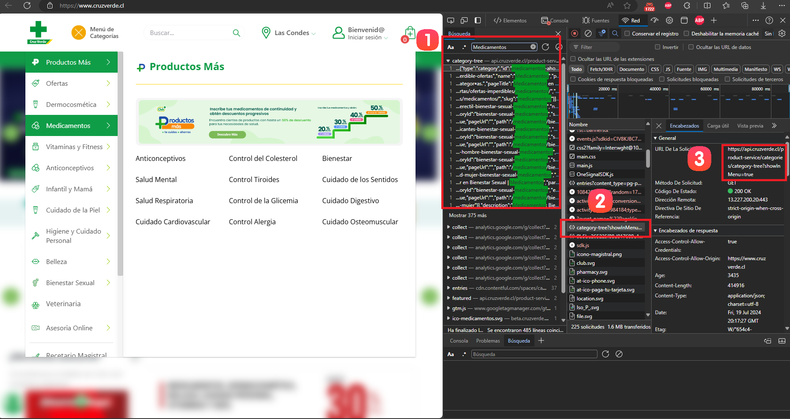
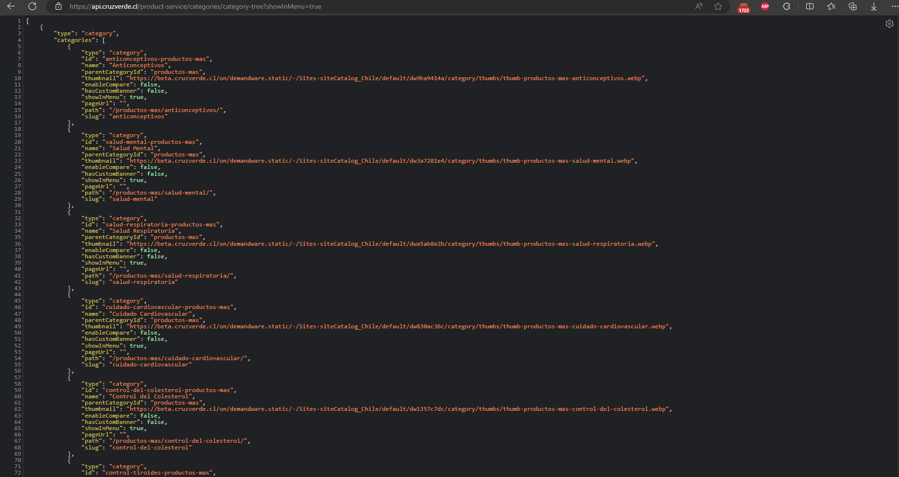
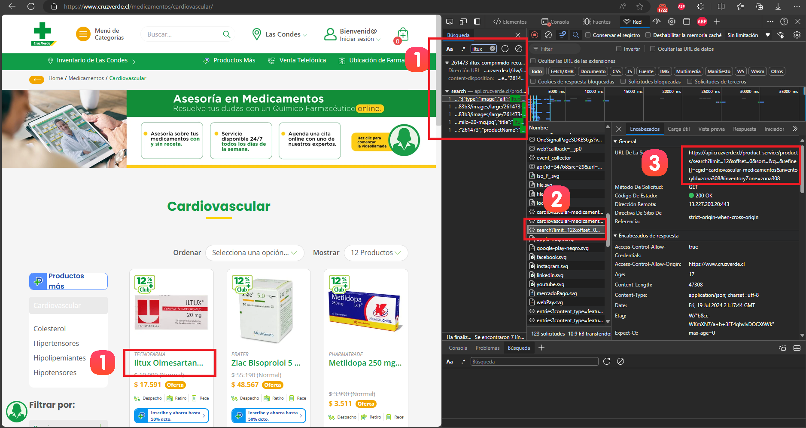
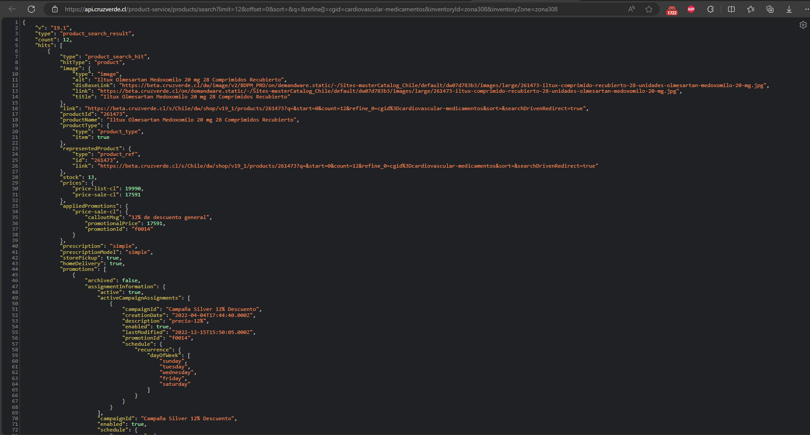

# Documentación del Spider de Cruz Verde

## Resumen
Este spider está diseñado para extraer información de productos del sitio web de Cruz Verde (cruzverde.cl). Utiliza Scrapy y Selenium para interactuar con las APIs del sitio y extraer datos de los productos en diferentes categorías.

## Paso 1: Configuración Inicial

### 1.1 Configuración del Navegador
El spider comienza configurando el navegador Chrome en modo headless:

```python
def __init__(self, *args, **kwargs):
    super().__init__(*args, **kwargs)
    chrome_options = Options()
    chrome_options.add_argument("--headless")
    service = Service(ChromeDriverManager().install())
    self.driver = webdriver.Chrome(service=service, options=chrome_options)
    self.visited_urls = set()
    self.processed_categories = set()
```

Esta configuración permite al spider navegar por el sitio web de manera invisible y eficiente.

## Paso 2: Extracción de la API de Categorías

### 2.1 Proceso de Identificación de la API de Categorías

Para identificar la API de categorías, seguimos estos pasos:



0. Navegar al sitio web de Cruz Verde (cruzverde.cl). Abrir las herramientas de desarrollador (F12) en el navegador y navegar a la pestaña "Network".
1. En el buscador de las herramientas de desarrollador, escribir el nombre de una categoría conocida, como "Medicamentos".
2. Entre las peticiones resaltadas, buscar aquella que parezca contener información de categorías.
3. Al seleccionar la petición relevante, se puede ver la URL de la API en los detalles de la petición.

La URL de la API de categorías identificada es:
```
https://api.cruzverde.cl/product-service/categories/category-tree?showInMenu=true
```

### 2.2 Estructura de la Respuesta de la API de Categorías

Al realizar una petición a esta API, obtenemos una respuesta JSON con la siguiente estructura:



```json
[
  {
    "id": "categoria1",
    "name": "Nombre Categoría 1",
    "path": "/categoria-1",
    "categories": [
      {
        "id": "subcategoria1",
        "name": "Nombre Subcategoría 1",
        "path": "/categoria-1/subcategoria-1"
      }
    ]
  },
  // ... más categorías ...
]
```

### 2.3 Implementación en el Spider

El spider utiliza la API de categorías identificada para obtener la estructura de categorías:

```python
def parse(self, response):
    self.driver.get(response.url)
    try:
        WebDriverWait(self.driver, 10).until(
            EC.presence_of_element_located((By.TAG_NAME, 'body'))
        )
        cookies = self.driver.get_cookies()
        for cookie in cookies:
            self.driver.add_cookie(cookie)

        api_url = 'https://api.cruzverde.cl/product-service/categories/category-tree?showInMenu=true'
        self.driver.get(api_url)
        WebDriverWait(self.driver, 10).until(
            EC.presence_of_element_located((By.TAG_NAME, 'body'))
        )
        data = json.loads(self.driver.find_element(By.TAG_NAME, 'body').text)
        for item in data:
            yield from self.extract_category(item, path=[])
    except Exception as e:
        self.logger.error(f"Error loading page: {str(e)}")
        self.driver.quit()
```

## Paso 3: Extracción de la API de Productos

### 3.1 Proceso de Identificación de la API de Productos

Para identificar la API de productos, seguimos un proceso similar:



0. Navegar a una categoría específica, por ejemplo, `"/medicamentos/cardiovascular"`.
2. En el buscador de las herramientas de desarrollador, escribir el nombre de un producto visible en la lista.
3. Entre las peticiones resaltadas, buscar aquella que contenga información de productos.
4. Al seleccionar la petición relevante, se puede ver la URL de la API en los detalles de la petición.

La URL de la API de productos identificada es:
```
https://api.cruzverde.cl/product-service/products/search?limit={limit}&offset={offset}&sort=&q=&refine[]=cgid={category_id}&inventoryId=zona308&inventoryZone=zona308
```

### 3.2 Estructura de la Respuesta de la API de Productos

Al realizar una petición a esta API, obtenemos una respuesta JSON con la siguiente estructura:



```json
{
  "total": 100,
  "hits": [
    {
      "productId": "12345",
      "productName": "Nombre del Producto",
      "brand": "Marca del Producto",
      "image": {
        "link": "https://cruzverde.cl/images/12345-categoria.jpg"
      },
      "prices": {
        "price-list-cl": "10000",
        "price-sale-cl": "8000"
      }
    },
    // ... más productos ...
  ]
}
```

### 3.3 Implementación en el Spider

El spider utiliza la API de productos para extraer información de cada categoría:

```python
def load_category_page(self, response):
    try:
        WebDriverWait(self.driver, 10).until(
            EC.presence_of_element_located((By.TAG_NAME, 'body'))
        )

        category_id = response.meta['category_id']
        category_path = response.meta['category_path']
        offset = 0
        limit = 48

        # Obtener el total de productos en la primera iteración
        api_url = f"https://api.cruzverde.cl/product-service/products/search?limit={limit}&offset={offset}&sort=&q=&refine[]=cgid={category_id}&inventoryId=zona308&inventoryZone=zona308"
        self.driver.get(api_url)
        WebDriverWait(self.driver, 10).until(
            EC.presence_of_element_located((By.TAG_NAME, 'body'))
        )
        data = json.loads(self.driver.find_element(By.TAG_NAME, 'body').text)

        total_products = data.get('total', 0)
        iterations = (total_products + limit - 1) // limit  # Número total de iteraciones necesarias

        for i in range(iterations):
            offset = i * limit
            api_url = f"https://api.cruzverde.cl/product-service/products/search?limit={limit}&offset={offset}&sort=&q=&refine[]=cgid={category_id}&inventoryId=zona308&inventoryZone=zona308"
            self.driver.get(api_url)
            WebDriverWait(self.driver, 10).until(
                EC.presence_of_element_located((By.TAG_NAME, 'body'))
            )
            data = json.loads(self.driver.find_element(By.TAG_NAME, 'body').text)
            
            for product in data.get('hits', []):
                # Procesamiento de cada producto
                # ...

    except Exception as e:
        self.logger.error(f"Error loading category page: {str(e)}")
```

## Paso 4: Lógica de Extracción de Información

### 4.1 Estructura del JSON de Categorías

La API de categorías devuelve un array de objetos JSON, donde cada objeto representa una categoría principal:

```json
[
  {
    "id": "categoria1",
    "name": "Nombre Categoría 1",
    "path": "/categoria-1",
    "categories": [
      {
        "id": "subcategoria1",
        "name": "Nombre Subcategoría 1",
        "path": "/categoria-1/subcategoria-1"
      }
    ]
  },
  // ... más categorías ...
]
```

### 4.2 Extracción de Información de Categorías

El spider recorre este array y extrae la siguiente información para cada categoría:

- `id`: Identificador único de la categoría
- `name`: Nombre de la categoría
- `path`: Ruta URL de la categoría

Código de extracción:

```python
def extract_category(self, category, path):
    new_path = path + [category['name']]
    category_id = category['id']
    full_url = f"https://www.cruzverde.cl{category['path']}"

    if full_url not in self.visited_urls and category_id not in self.processed_categories:
        self.visited_urls.add(full_url)
        self.processed_categories.add(category_id)
        yield scrapy.Request(full_url, callback=self.load_category_page, 
                             meta={'category_path': new_path, 'category_id': category_id, 'category_url': full_url})
```

### 4.3 Estructura del JSON de Productos

La API de productos devuelve un objeto JSON con la siguiente estructura:

```json
{
  "total": 100,
  "hits": [
    {
      "productId": "12345",
      "productName": "Nombre del Producto",
      "brand": "Marca del Producto",
      "image": {
        "link": "https://cruzverde.cl/images/12345-categoria.jpg"
      },
      "prices": {
        "price-list-cl": "10000",
        "price-sale-cl": "8000"
      }
    },
    // ... más productos ...
  ]
}
```

### 4.4 Extracción de Información de Productos

Para cada producto en el array `hits`, el spider extrae la siguiente información:

1. **Código del Producto**: 
   - Se extrae del enlace de la imagen del producto.
   ```python
   image_link = product['image']['link']
   product_code, cat_code = image_link.split('/')[-1].split('-', 1)
   ```

2. **URL del Producto**:
   - Se construye utilizando el código del producto y el código de categoría.
   ```python
   product_url = f"https://www.cruzverde.cl/{cat_code}/{product_code}.html"
   ```

3. **Marca**: 
   - Se obtiene directamente del campo 'brand'.
   ```python
   brand = product.get('brand', 'Unknown Brand')
   ```

4. **Nombre del Producto**: 
   - Se obtiene del campo 'productName'.
   ```python
   name = product.get('productName', 'Unknown Product Name')
   ```

5. **Precios**: 
   - Se extraen del objeto 'prices' dentro del producto.
   ```python
   price = product.get('prices', {}).get('price-list-cl', '0')
   price_sale = product.get('prices', {}).get('price-sale-cl', '0')
   ```

6. **SKU**: 
   - Se utiliza el campo 'productId'.
   ```python
   sku = product.get('productId', 'No SKU')
   ```

### 4.5 Carga de Datos en ItemLoader

Toda esta información se carga en un ItemLoader para su procesamiento posterior:

```python
loader = ItemLoader(item=ScrPharmaItem())
loader.add_value('brand', brand)
loader.add_value('name', name)
loader.add_value('url', product_url)
loader.add_value('price', price)
loader.add_value('price_sale', price_sale)
loader.add_value('price_benef', '0')
loader.add_value('code', sku)
loader.add_value('category', ' > '.join(category_path))
loader.add_value('timestamp', datetime.now())
loader.add_value('spider_name', self.name)
```

### 4.6 Manejo de Datos Faltantes

El spider utiliza el método `get()` con valores por defecto para manejar casos donde ciertos campos puedan estar ausentes en el JSON:

```python
product.get('brand', 'Unknown Brand')
product.get('productName', 'Unknown Product Name')
product.get('productId', 'No SKU')
```

Esto asegura que el spider no falle si algún campo esperado no está presente en la respuesta de la API.


## Paso 5: Manejo de Paginación

El spider maneja la paginación calculando el número total de iteraciones necesarias basado en el total de productos reportado por la API:

```python
total_products = data.get('total', 0)
iterations = (total_products + limit - 1) // limit

for i in range(iterations):
    offset = i * limit
    # ... solicitud a la API y procesamiento de productos ...
```

## Paso 6: Manejo de Errores y Cierre

El spider incluye manejo de excepciones para lidiar con posibles errores durante la extracción de datos. Además, asegura que el driver de Selenium se cierre correctamente al finalizar:

```python
def closed(self, reason):
    self.driver.quit()
```

## Notas Adicionales
- Este spider se basa principalmente en interacciones con APIs, en lugar de navegar por el sitio web directamente.
- Se utilizan dos APIs principales: una para obtener la estructura de categorías y otra para obtener los productos de cada categoría.
- La extracción de datos se realiza parseando las respuestas JSON de las APIs, lo que permite una extracción más eficiente y robusta en comparación con el scraping tradicional basado en HTML.
- El uso de APIs permite manejar grandes volúmenes de datos y paginación de manera más eficiente.
- Es importante mantener actualizado el spider en caso de que las URLs o estructuras de las APIs cambien en el futuro.
- El spider mantiene un registro de URLs y categorías visitadas para evitar duplicados.
- Se utiliza Selenium principalmente para manejar cookies y realizar solicitudes a las APIs, no para navegar por el sitio web.