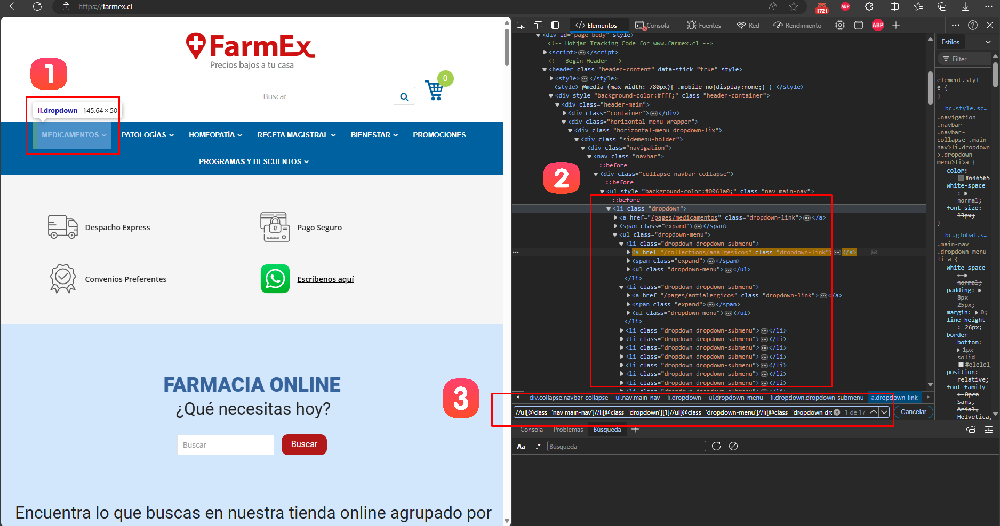
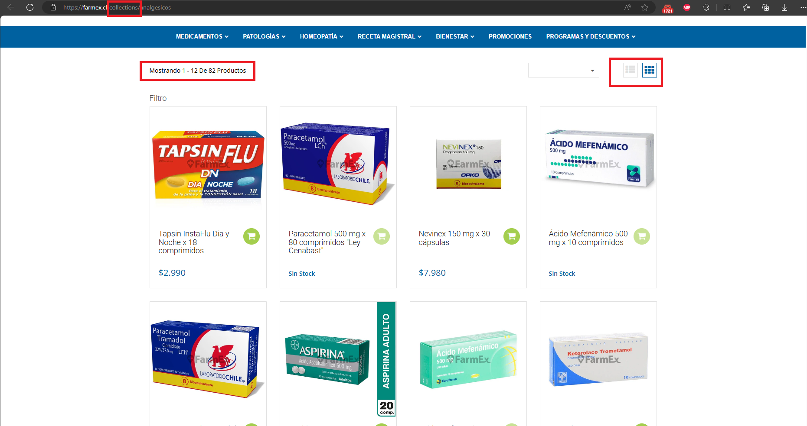
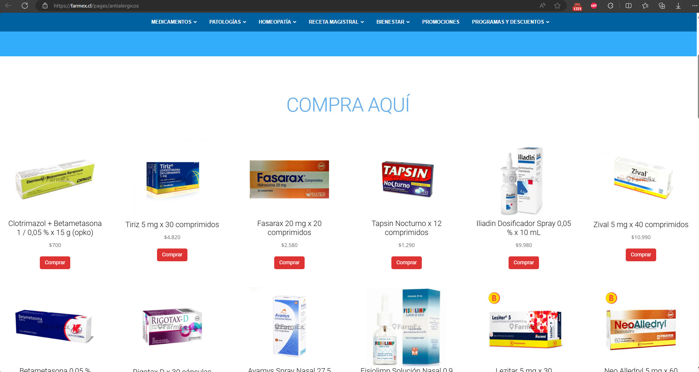
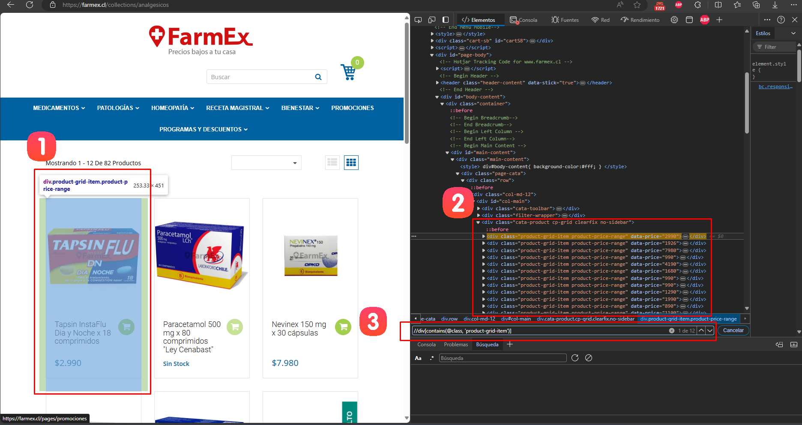
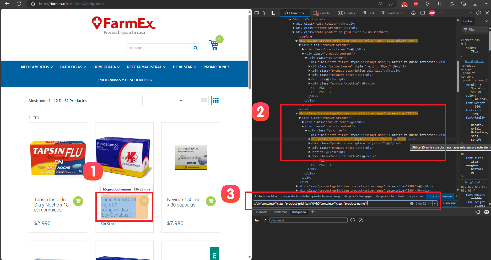
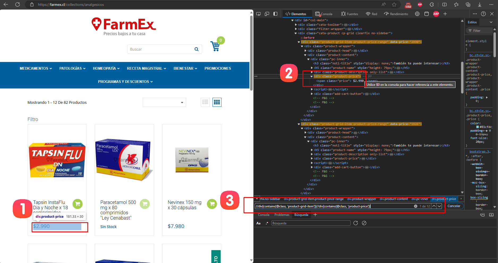
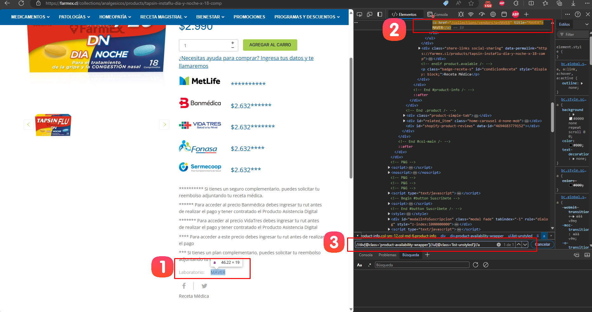

# Documentación del Spider de Farmex

## Resumen
Este spider está diseñado para extraer información de productos del sitio web de Farmex (farmex.cl). Utiliza Scrapy y Selenium para navegar por el sitio, manejar contenido dinámico y extraer datos de los productos en diferentes categorías.

## Paso 1: Configuración Inicial y Definición de Categorías

### 1.1 Configuración del Navegador
El spider comienza configurando el navegador Chrome en modo headless:

```python
def __init__(self, *args, **kwargs):
    super().__init__(*args, **kwargs)
    chrome_options = Options()
    chrome_options.add_argument("--headless")
    service = Service(ChromeDriverManager().install())
    self.driver = webdriver.Chrome(service=service, options=chrome_options)
    self.action = ActionChains(self.driver)
```

### 1.2 Extracción Dinámica de Categorías
A diferencia de otros spiders, Farmex extrae dinámicamente las categorías del sitio web. Este proceso se realiza siguiendo estos pasos:


1. **Acceder a la página principal**: 
   - Visitar la página principal de Farmex.

2. **Extraer las categorías**:
   - Utilizar Selenium para encontrar y extraer los elementos de categoría.

3. **Almacenar las categorías**:
   - Guardar las categorías extraídas para su posterior uso.

Código para extraer las categorías:

```python
def parse_categories(self, response):
    self.driver.get(response.url)
    time.sleep(2)  # Wait for JavaScript to load contents
    self.close_popup()
    category_elements = self.driver.find_elements(By.XPATH, "//ul[@class='nav main-nav']//li[@class='dropdown'][1]//ul[@class='dropdown-menu']//li[@class='dropdown dropdown-submenu']//a[@class='dropdown-link']")
    
    categories = []
    for element in category_elements:
        category_url = element.get_attribute('href')
        category_name = category_url.split('/')[-1]
        categories.append((category_name, category_url))
```

## Paso 2: Iniciando el Proceso de Scraping

El spider comienza visitando la página principal de Farmex:

```python
def start_requests(self):
    yield scrapy.Request(url=self.start_urls[0], callback=self.parse_categories)
```

Este método inicia el proceso de scraping, enviando una solicitud a la página principal de Farmex.

## Paso 3: Navegación por Categorías y Paginación

### 3.1 Navegación por Categorías

El spider de Farmex está diseñado para manejar dos tipos diferentes de páginas de categorías, cada una con su propia estructura y método de extracción. La distinción se basa en la URL de la categoría:

1. **Páginas de Colecciones**:
   - Identificadas por la presencia de "collections" en la URL.
   - Estas páginas listan múltiples productos y pueden tener paginación.
   - Ejemplo de URL: `https://farmex.cl/collections/categoria-ejemplo`

2. **Páginas Únicas**:
   - No contienen "collections" en la URL.
   - Estas son páginas de producto único o páginas con una estructura diferente.
   - No tienen paginación.
   - Ejemplo de URL: `https://farmex.cl/pages/producto-ejemplo`


El spider determina el tipo de página y aplica el método de extracción apropiado:

```python
def parse_category(self, response):
    category = response.meta['category_name']
    category_url = response.meta['category_url']
    
    if 'collections' in category_url or 'collections' in category:
        yield from self.parse_collections(response, category)
    else:
        yield from self.parse_pages(response, category)
```

#### Páginas de Colecciones



Para las páginas de colecciones, el spider utiliza el método `parse_collections`:

```python
def parse_collections(self, response, category):
    self.driver.get(response.url)
    time.sleep(2)  # Wait for JavaScript to load contents
    self.close_popup()

    page_number = 1
    while True:
        items = list(self.extract_items(category))
        
        if not items:
            self.logger.info(f"No more products found in category {category}. Ending pagination.")
            break

        for item in items:
            yield item

        # Navegación a la siguiente página
        page_number += 1
        next_page_url = f"{response.url.split('?')[0]}?page={page_number}"
        self.driver.get(next_page_url)
        time.sleep(2)
        self.close_popup()

        if not self.driver.find_elements(By.XPATH, "//div[contains(@class, 'product-grid-item')]"):
            self.logger.info(f"No more products found on page {page_number} of category {category}. Ending pagination.")
            break
```

Este método maneja la paginación y extrae los productos de cada página.

#### Páginas Únicas



Para las páginas únicas, el spider utiliza el método `parse_pages`:

```python
def parse_pages(self, response, category):
    self.driver.get(response.url)
    time.sleep(2)  # Wait for JavaScript to load contents
    self.close_popup()

    # Extract items from the single page
    items = list(self.extract_page_items(category))
    
    for item in items:
        yield item
```

Este método extrae la información de la página única sin manejar paginación.

### 3.2 Manejo de la Paginación

La paginación solo se aplica a las páginas de colecciones. El spider construye las URLs para las páginas siguientes y verifica la presencia de productos en cada nueva página.
## Paso 4: Extracción de Datos de Productos

### 4.1 Identificación del XPath para Productos

Para identificar el XPath que selecciona todos los productos:



1. Elegir un elemento producto y hacer clic derecho -> Inspeccionar (o presionar F12).
2. En el panel de herramientas de desarrollador, identificar el tag `<div>` que contiene la información de productos.
3. Construir el XPath que selecciona cada tag de producto: `"//div[contains(@class, 'product-grid-item')]"`

```python
products = self.driver.find_elements(By.XPATH, "//div[contains(@class, 'product-grid-item')]")
```

### 4.2 Extracción de Detalles del Producto

#### 4.2.1 Extracción de la URL y Nombre del Producto



1. Elegir un elemento producto y hacer clic derecho -> Inspeccionar (o presionar F12).
2. En el panel de herramientas de desarrollador, identificar el tag `<a>` que contiene la información de productos.
3. Construir el XPath que selecciona cada tag de producto: `"//div[contains(@class, 'product-grid-item')]//h5[contains(@class, 'product-name')]"`

```python
product_name_element = product.find_element(By.XPATH, ".//h5[contains(@class, 'product-name')]//a")
product_url = product_name_element.get_attribute('href')
product_name = product_name_element.text
```

#### 4.2.2 Extracción del Precio



1. Elegir un elemento producto y hacer clic derecho -> Inspeccionar (o presionar F12).
2. En el panel de herramientas de desarrollador, identificar el tag `<span>` que contiene la información de productos.
3. Construir el XPath que selecciona cada tag de producto: `"//div[contains(@class, 'product-grid-item')]//div[contains(@class, 'product-price')]//span"`

```python
price_elements = product.find_elements(By.XPATH, ".//div[contains(@class, 'product-price')]//span")
if len(price_elements) == 1:
    price = price_elements[0].text
    price_sale = 'No sale price'
elif len(price_elements) == 2:
    price = price_elements[0].text
    price_sale = price_elements[1].text
else:
    price = 'No price'
    price_sale = 'No sale price'
```

#### 4.2.3 Extracción de la Marca

La extracción de la marca se realiza navegando a la página del producto:



1. Elegir un elemento producto y hacer clic derecho -> Inspeccionar (o presionar F12).
2. En el panel de herramientas de desarrollador, identificar el tag `<div>` que contiene la información de productos.
3. Construir el XPath que selecciona cada tag de producto: `"//div[@class='product-availability-wrapper']//ul[@class='list-unstyled']//a"`

```python
self.driver.execute_script("window.open(arguments[0], '_blank');", product_url)
self.driver.switch_to.window(self.driver.window_handles[-1])

try:
    WebDriverWait(self.driver, 10).until(EC.presence_of_element_located((By.XPATH, "//div[@class='product-availability-wrapper']//ul[@class='list-unstyled']//a")))
    brand_element = self.driver.find_element(By.XPATH, "//div[@class='product-availability-wrapper']//ul[@class='list-unstyled']//a")
    brand = brand_element.text
except NoSuchElementException:
    brand = 'No brand'

self.driver.close()
self.driver.switch_to.window(self.driver.window_handles[0])
```

### 4.3 Manejo de Casos Especiales

El spider incluye lógica para manejar casos donde ciertos elementos pueden no estar presentes:

```python
if price_sale == 'No sale price' or "Sin Stock" in price_sale:
    try:
        WebDriverWait(self.driver, 10).until(EC.presence_of_element_located((By.XPATH, "//div[@class='product-price']//div[@class='detail-price']")))
        price = self.driver.find_element(By.XPATH, "//div[@class='product-price']//div[@class='detail-price']").text
    except NoSuchElementException:
        price = 'No price'
```

## Paso 5: Carga de Datos en el Item Loader

Los datos extraídos se cargan en un ItemLoader para su posterior procesamiento:

```python
loader = ItemLoader(item=ScrPharmaItem(), selector=product)
loader.add_value('brand', brand)
loader.add_value('url', product_url)
loader.add_value('name', product_name)
loader.add_value('price', price)
loader.add_value('price_sale', price_sale)
loader.add_value('price_benef', price_benef)
loader.add_value('code', sku)
loader.add_value('category', category)
loader.add_value('timestamp', datetime.now())
loader.add_value('spider_name', self.name)
yield loader.load_item()
```

## Paso 6: Manejo de Popups

El spider incluye una función para cerrar popups que puedan interferir con el scraping:


```python
def close_popup(self):
    try:
        body = self.driver.find_element(By.TAG_NAME, 'body')
        self.action.move_to_element(body).click().perform()
        time.sleep(1)
    except Exception as e:
        print(f"Error closing popup: {str(e)}")
```

## Paso 7: Manejo de Errores y Cierre

El spider incluye manejo de excepciones y asegura que el driver de Selenium se cierre correctamente al finalizar:

```python
def closed(self, reason):
    self.driver.quit()
```

## Notas Adicionales
- El spider utiliza delays (time.sleep()) para asegurar que el contenido dinámico se cargue completamente.
- Se implementa un mecanismo para cerrar popups que puedan interferir con la extracción de datos.
- El spider maneja diferentes estructuras de precios (precio normal, precio de venta, etc.).
- Se navega a la página de cada producto para extraer información adicional como la marca.
- Se utiliza un enfoque robusto para manejar casos donde ciertos elementos pueden no estar presentes en la página.
- La paginación se maneja construyendo URLs para cada página siguiente y verificando la presencia de productos.
- El spider distingue entre colecciones y páginas regulares, aplicando diferentes estrategias de extracción según sea necesario.