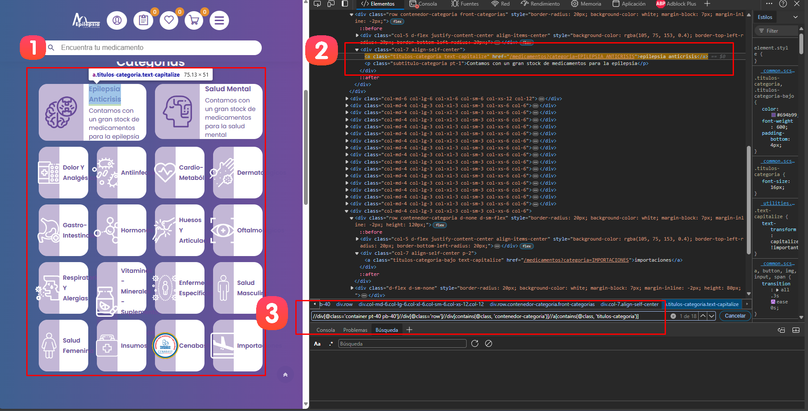
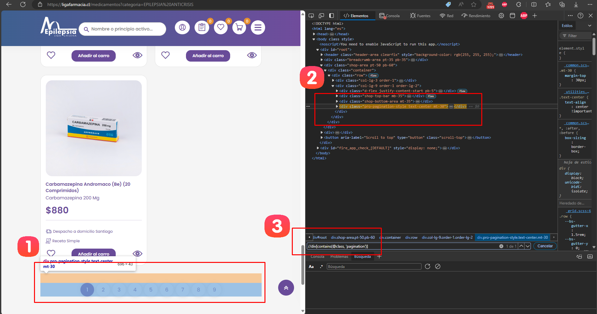
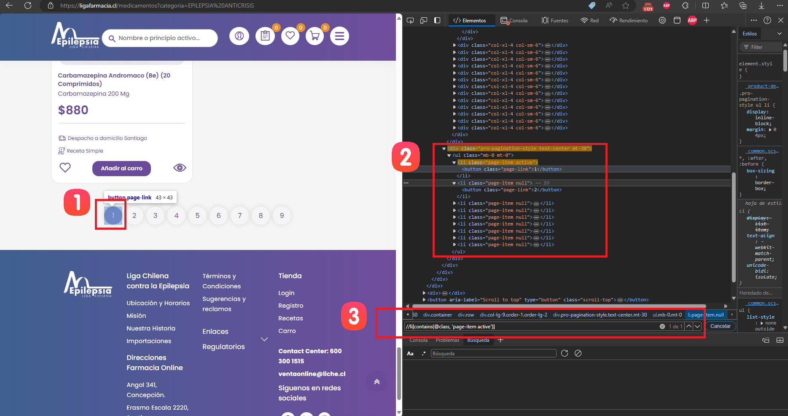
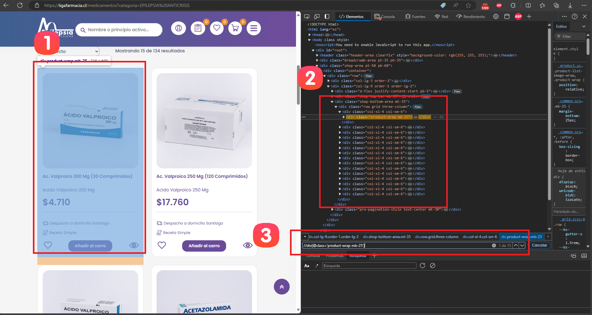
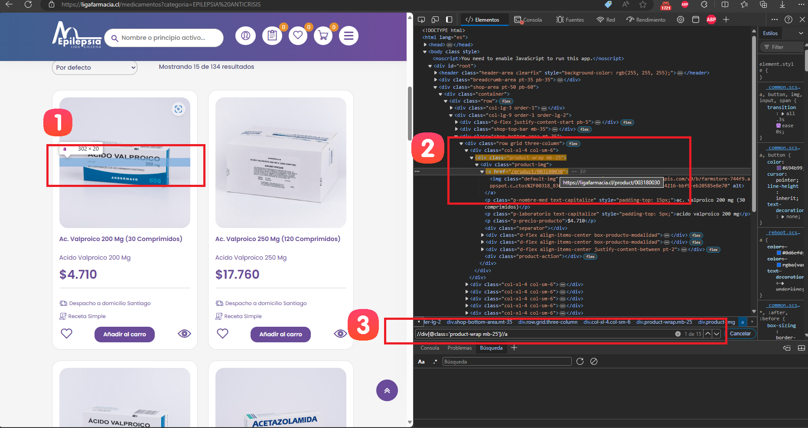
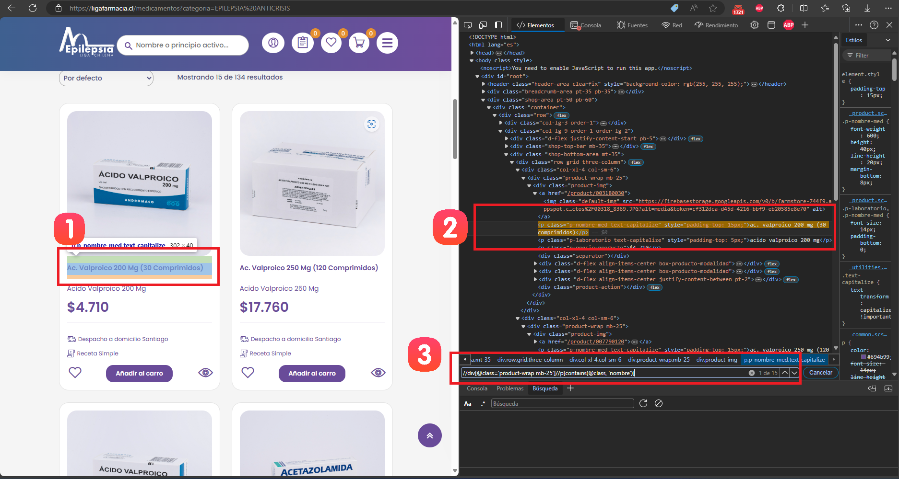
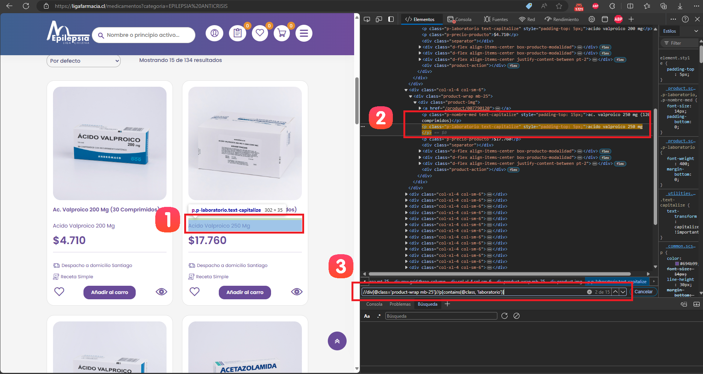
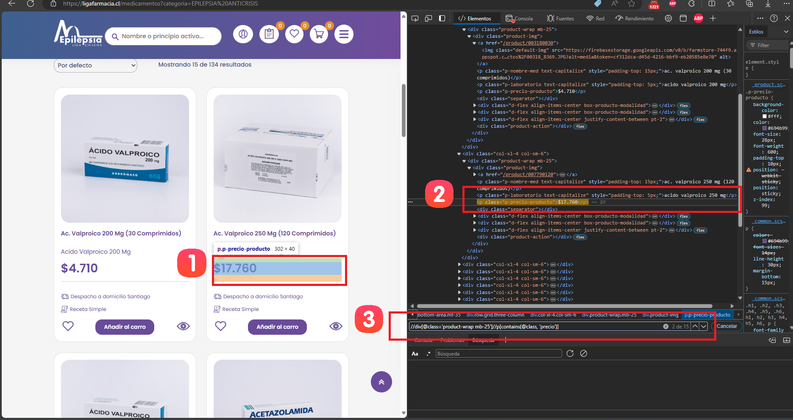

# Documentación del Spider de Liga Farmacia

## Resumen
Este spider está diseñado para extraer información de productos del sitio web de Liga Farmacia (ligafarmacia.cl). Utiliza Scrapy y Selenium para navegar por el sitio y extraer datos de los productos.

## Paso 1: Configuración Inicial y Definición de Categorías

### 1.1 Configuración del Navegador
El spider comienza configurando el navegador Chrome en modo headless:

```python
def __init__(self, *args, **kwargs):
    super().__init__(*args, **kwargs)
    chrome_options = Options()
    chrome_options.add_argument("--headless")
    service = Service(ChromeDriverManager().install())
    self.driver = webdriver.Chrome(service=service, options=chrome_options)
    self.categories = []
```

### 1.2 Definición de Categorías
A diferencia de otros spiders, Liga Farmacia extrae dinámicamente las categorías del sitio web. Este proceso se realiza siguiendo estos pasos:


1. **Acceder a la página principal**: 
   - Visitar la página principal de Liga Farmacia.

2. **Extraer las categorías**:
   - Utilizar Selenium para encontrar y extraer los elementos de categoría.

3. **Almacenar las categorías**:
   - Guardar las categorías extraídas para su posterior uso.

Código para extraer las categorías:




1. Elegir una categoria y hacer clic derecho -> Inspeccionar (o presionar F12).
2. En el panel de herramientas de desarrollador, identificar el tag `"<a>"` que contiene la información de categorias.
3. Construir el XPath que selecciona todos las categorias: `"//div[@class='container pt-40 pb-40']//div[@class='row']//div[contains(@class, 'contenedor-categoria')]//a[contains(@class, 'titulos-categoria')]"`
```python
category_elements = self.driver.find_elements(By.XPATH, "//div[@class='container pt-40 pb-40']//div[@class='row']//div[contains(@class, 'contenedor-categoria')]//a[contains(@class, 'titulos-categoria')]")
for element in category_elements:
    category_name = element.text
    category_url = element.get_attribute('href')
    self.categories.append((category_name, category_url))
```
## Paso 2: Iniciando el Proceso de Scraping

El spider comienza visitando la página principal de Liga Farmacia.

```python
def start_requests(self):
    yield scrapy.Request(url='https://ligafarmacia.cl', callback=self.parse, dont_filter=True)
```

Este método inicia el proceso de scraping, enviando una solicitud a la página principal de Liga Farmacia.

## Paso 3: Navegación por Categorías y Paginación

### 3.1 Navegación por Categorías

El spider itera sobre las categorías extraídas:

```python
def parse(self, response):
    self.driver.get(response.url)
    time.sleep(5)  # Wait for JavaScript to load contents
    
    for category_name, category_url in self.categories:
        self.driver.get(category_url)
        time.sleep(5)  # Wait for JavaScript to load contents
```


### 3.2 Manejo de la Paginación

El spider implementa un mecanismo para navegar a través de todas las páginas de productos:




1. Elegir elemento paginación y hacer clic derecho -> Inspeccionar (o presionar F12).
2. En el panel de herramientas de desarrollador, identificar el tag `"<div>"` que contiene la información de paginación.
3. Construir el XPath que selecciona el tag de paginación: `"//div[contains(@class, 'pagination')]"`
```python
def scroll_to_pagination(self):
    try:
        pagination_element = self.driver.find_element(By.XPATH, "//div[contains(@class, 'pagination')]")
        self.driver.execute_script("arguments[0].scrollIntoView(true);", pagination_element)
        WebDriverWait(self.driver, 10).until(EC.visibility_of(pagination_element))
    except (NoSuchElementException, TimeoutException):
        print("Pagination element not found or not visible.")
```




1. Elegir elemento pagina actual y hacer clic derecho -> Inspeccionar (o presionar F12).
2. En el panel de herramientas de desarrollador, identificar el tag `"<li>"` que contiene la información de pagina actual.
3. Construir el XPath que selecciona la pagina actual: `"//li[contains(@class, 'page-item active')]"`

```python
def get_next_page_button(self):
    try:
        active_page = self.driver.find_element(By.XPATH, "//li[contains(@class, 'page-item active')]")
        next_page_button = active_page.find_element(By.XPATH, "following-sibling::li[1]//button")
        if next_page_button:
            return next_page_button
    except NoSuchElementException:
        return None
```

## Paso 4: Extracción de Datos de Productos

### 4.1 Identificación del XPath para Productos

Para identificar el XPath que selecciona todos los productos:



1. Elegir un elemento de producto y hacer clic derecho -> Inspeccionar (o presionar F12).
2. En el panel de herramientas de desarrollador, identificar el tag `"<div>"` que contiene la información de productos.
3. Construir el XPath que selecciona cada producto: `"//div[@class='product-wrap mb-25']"`

```python
products = self.driver.find_elements(By.XPATH, "//div[@class='product-wrap mb-25']")
```

### 4.2 Extracción de Detalles del Producto

#### 4.2.1 Extracción de la URL del Producto



1. Elegir un elemento de producto y hacer clic derecho -> Inspeccionar (o presionar F12).
2. En el panel de herramientas de desarrollador, identificar el tag `<a>` que contiene la información de productos.
3. Construir el XPath que selecciona cada `<a>` que contiene href como atributos: `"//a"`

```python
product_url = product.find_element(By.XPATH, ".//a").get_attribute('href')
```

#### 4.2.2 Extracción del Nombre del Producto



1. Elegir un elemento nombre de producto y hacer clic derecho -> Inspeccionar (o presionar F12).
2. En el panel de herramientas de desarrollador, identificar el tag `<p>` que contiene la información de productos.
3. Construir el XPath que selecciona cada nombre de producto: `"//p[contains(@class, 'nombre')]"`

```python
product_name = product.find_element(By.XPATH, ".//p[contains(@class, 'nombre')]").text
```

#### 4.2.3 Extracción de la Marca



1. Elegir un elemento marca de producto y hacer clic derecho -> Inspeccionar (o presionar F12).
2. En el panel de herramientas de desarrollador, identificar el tag `<p>` que contiene la información de marca de productos.
3. Construir el XPath que selecciona cada marca de producto: `"//p[contains(@class, 'laboratorio')]"`


```python
brand = product.find_element(By.XPATH, ".//p[contains(@class, 'laboratorio')]").text
```

#### 4.2.4 Extracción del Precio



1. Elegir un elemento precio de producto y hacer clic derecho -> Inspeccionar (o presionar F12).
2. En el panel de herramientas de desarrollador, identificar el tag `<p>` que contiene la información de precio de productos.
3. Construir el XPath que selecciona cada precio de producto: `"//p[contains(@class, 'precio')]"`

```python
price = product.find_element(By.XPATH, ".//p[contains(@class, 'precio')]").text
```

### 4.3 Manejo de Casos Especiales

El spider incluye manejo de excepciones para casos donde ciertos elementos pueden no estar presentes:

```python
try:
    product_url = product.find_element(By.XPATH, ".//a").get_attribute('href')
except NoSuchElementException:
    product_url = 'No URL'
try:
    product_name = product.find_element(By.XPATH, ".//p[contains(@class, 'nombre')]").text
except NoSuchElementException:
    product_name = 'No name'
# ... (manejo similar para otros campos)
```

## Paso 5: Carga de Datos en el Item Loader

Los datos extraídos se cargan en un ItemLoader para su posterior procesamiento:

```python
loader = ItemLoader(item=ScrPharmaItem(), selector=product)
loader.add_value('brand', brand)
loader.add_value('url', product_url)
loader.add_value('name', product_name)
loader.add_value('price', price)
loader.add_value('price_sale', price_sale)
loader.add_value('price_benef', price_benef)
loader.add_value('code', sku)
loader.add_value('category', category_name)
loader.add_value('timestamp', datetime.now())
loader.add_value('spider_name', self.name)
yield loader.load_item()
```

## Paso 6: Manejo de Errores y Cierre

El spider incluye manejo de excepciones y asegura que el driver de Selenium se cierre correctamente al finalizar:

```python
def closed(self, reason):
    self.driver.quit()
```

## Notas Adicionales
- El spider utiliza delays (time.sleep()) para asegurar que el contenido dinámico se cargue completamente.
- Se implementa un scroll hasta el elemento de paginación para asegurar que esté visible antes de intentar hacer clic.
- El spider maneja casos donde ciertos elementos pueden no estar presentes en la página, proporcionando valores por defecto.
- La navegación a la siguiente página se realiza mediante JavaScript para evitar problemas con elementos no clicables.
- Se utiliza WebDriverWait para esperar que ciertos elementos estén visibles antes de interactuar con ellos.
- A diferencia de otros spiders, Liga Farmacia no tiene un SKU visible en la página de lista de productos, por lo que este campo se deja como 'No SKU'.