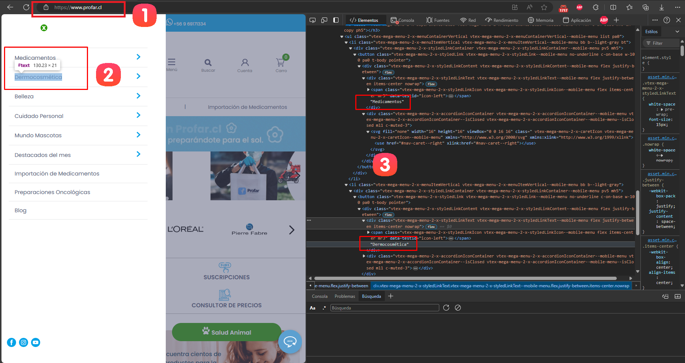
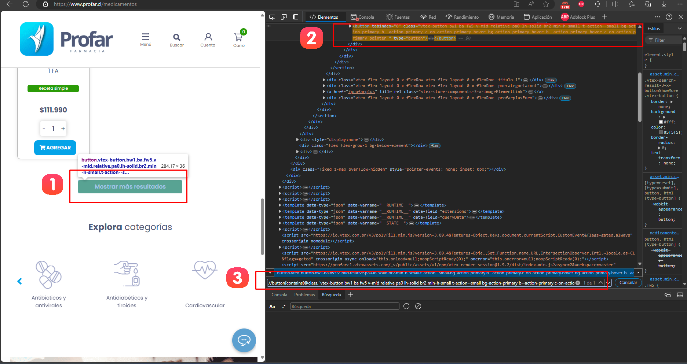
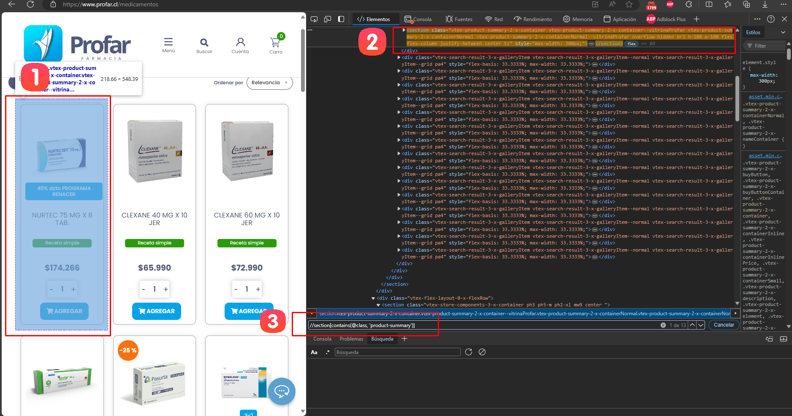
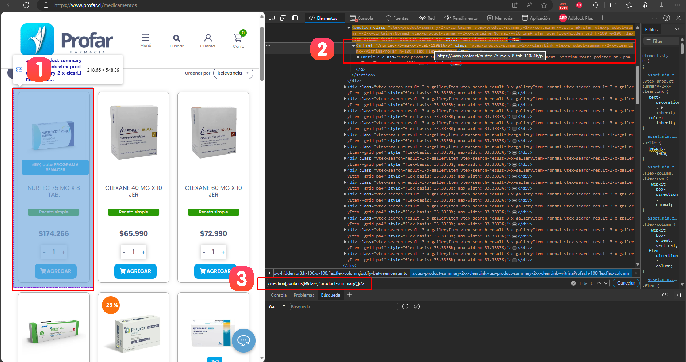
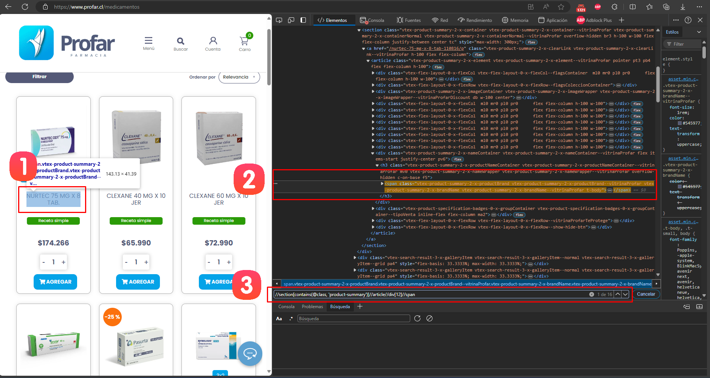
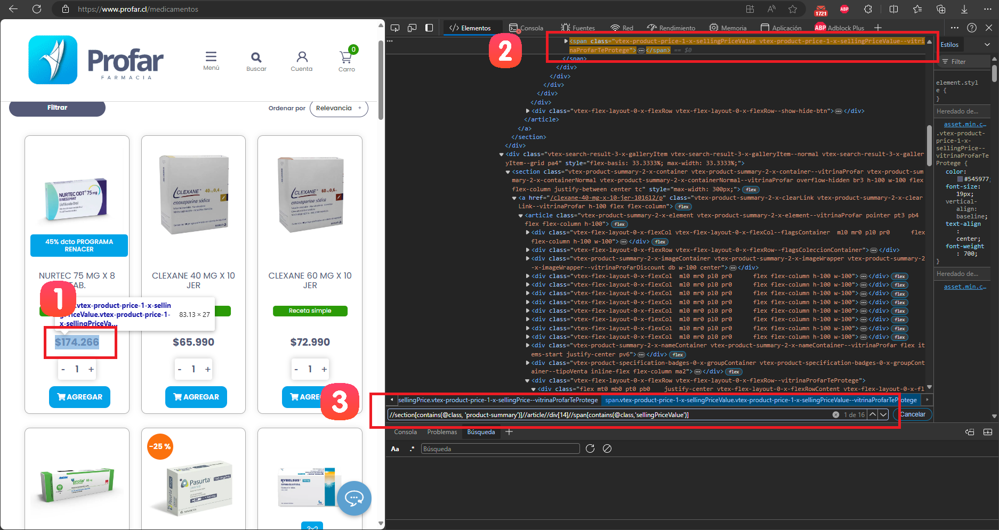
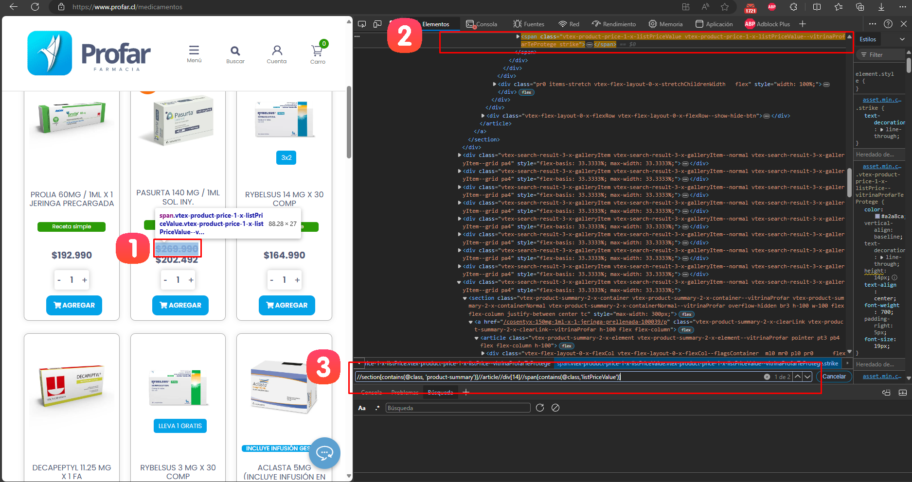

# Documentación del Spider de Profar

## Resumen
Este spider está diseñado para extraer información de productos del sitio web de Profar (profar.cl). Utiliza Scrapy y Selenium para navegar por el sitio y extraer datos de los productos.

## Paso 1: Configuración Inicial y Definición de Categorías

### 1.1 Configuración del Navegador
El spider comienza configurando el navegador Chrome en modo headless:

```python
def __init__(self, *args, **kwargs):
    super().__init__(*args, **kwargs)
    chrome_options = Options()
    chrome_options.add_argument("--headless")
    service = Service(ChromeDriverManager().install())
    self.driver = webdriver.Chrome(service=service, options=chrome_options)
```

### 1.2 Definición de Categorías
Las categorías a scrapear se definen manualmente en el código del spider. Este proceso se realiza siguiendo estos pasos:


1. **Acceder al menú de categorías**: 
   - Visitar la página principal de Profar.
   - Observar las categorías principales en el menú de navegación.

2. **Inspeccionar el DOM**:
   - Abrir las herramientas de desarrollador del navegador (F12 o clic derecho -> Inspeccionar).
   - Localizar la estructura de las categorías en el HTML.

3. **Identificar la estructura de las categorías**:
   - Las categorías se encuentran generalmente en elementos de lista o navegación.
   - Cada categoría suele tener un identificador único o una URL específica.

Basándonos en esta inspección, las categorías se definen en el código de la siguiente manera:

```python
self.categories = [
    'dermocosmetica',
    'medicamentos',            
    'belleza',
    'cuidado-personal',
    'salud-animal'
]
```

Estas categorías corresponden a las secciones principales identificadas en el sitio web de Profar.

## Paso 2: Iniciando el Proceso de Scraping

El spider comienza visitando la página principal de Profar.

```python
def start_requests(self):
    for url in self.start_urls:
        yield scrapy.Request(url=url, callback=self.parse, dont_filter=True)
```

Este método inicia el proceso de scraping, enviando una solicitud a la página principal de Profar.

## Paso 3: Navegación por Categorías y Uso de la API

En este paso, el spider navega por las categorías definidas y utiliza la estructura del sitio para obtener los productos.

### 3.1 Navegación por Categorías

El spider itera sobre las categorías predefinidas:

```python
def parse(self, response):
    self.driver.get(response.url)
    base_url = 'https://www.profar.cl/'
    for category in self.categories:
        url = f"{base_url}{category}"
        self.driver.get(url)
        time.sleep(5)  # Esperar a que se cargue el JavaScript
```
### 3.2 Manejo de la Paginación

El spider implementa un mecanismo para cargar más productos:




1. Identificamos que queremos encontrar el botón para mostrar mas resultados.
2. Inspeccionamos el elemento HTML del botón.
3. Identificamos el XPath que selecciona el botón: `"//button[contains(@class, 'vtex-button bw1 ba fw5 v-mid relative pa0 lh-solid br2 min-h-small t-action--small bg-action-primary b--action-primary c-on-action-primary hover-bg-action-primary hover-b--action-primary hover-c-on-action-primary pointer')]"`

```python
def scroll_to_pagination(self):
    try:
        self.driver.execute_script("window.scrollTo(0, document.body.scrollHeight);")
        time.sleep(2)
        load_more_button = self.driver.find_element(By.XPATH, "//button[contains(@class, 'vtex-button bw1 ba fw5 v-mid relative pa0 lh-solid br2 min-h-small t-action--small bg-action-primary b--action-primary c-on-action-primary hover-bg-action-primary hover-b--action-primary hover-c-on-action-primary pointer')]")
        self.driver.execute_script("arguments[0].scrollIntoView(true);", load_more_button)
        time.sleep(2)
        self.driver.execute_script("arguments[0].click();", load_more_button)
    except NoSuchElementException:
        print("Load more button not found.")
```

## Paso 4: Extracción de Datos de Productos

### 4.1 Identificación del XPath para Productos

Para identificar el XPath que selecciona todos los productos:



```python
products_after_click = self.driver.find_elements(By.XPATH, "//section[contains(@class, 'product-summary')]")
```
1. Elegir un producto y hacer clic derecho -> Inspeccionar (o presionar F12).
2. En el panel de herramientas de desarrollador, identificar el tag `"<selection>"` que contiene la información del producto.
3. Construir el XPath que selecciona todos los productos: `"//section[contains(@class, 'product-summary')]"`

### 4.2 Extracción de Detalles del Producto

#### 4.2.1 Extracción de la URL y SKU del Producto



1. Elegir un producto y hacer clic derecho -> Inspeccionar (o presionar F12).
2. En el panel de herramientas de desarrollador, identificar el tag `"<a>"` que contiene la información de url del producto.
3. Construir el XPath que selecciona todos url y sku de los productos: `"//section[contains(@class, 'product-summary')]//a"`

```python
product_url = product.find_element(By.XPATH, ".//a").get_attribute('href')
sku_part = product_url.split('/')[-2].split('-')[-1]
sku = sku_part if sku_part.isnumeric() else 'No SKU'
```

#### 4.2.2 Extracción del Nombre del Producto



1. Elegir un nombre de producto y hacer clic derecho -> Inspeccionar (o presionar F12).
2. En el panel de herramientas de desarrollador, identificar el tag `"<article>"` que contiene la información del nombre del producto.
3. Construir el XPath que selecciona todos los nombres de productos: `"//section[contains(@class, 'product-summary')]//article//div[12]//span"`

```python
product_name = product.find_element(By.XPATH, ".//article//div[12]//span").text
```

#### 4.2.3 Extracción del Precio



1. Elegir el precio de un producto y hacer clic derecho -> Inspeccionar (o presionar F12).
2. En el panel de herramientas de desarrollador, identificar el tag `"<article>"` que contiene la información del precio.
3. Construir el XPath que selecciona todos precios de los productos: `"//section[contains(@class, 'product-summary')]//article//div[14]//span[contains(@class,'sellingPriceValue')]"`


```python
price = product.find_element(By.XPATH, ".//article//div[14]//span[contains(@class,'sellingPriceValue')]").text
```

#### 4.2.4 Extracción del Precio de Venta



1. Elegir el precio en oferta de un producto y hacer clic derecho -> Inspeccionar (o presionar F12).
2. En el panel de herramientas de desarrollador, identificar el tag `"<article>"` que contiene la información del precio oferta.
3. Construir el XPath que selecciona todos precios en oferta de los productos: `"//section[contains(@class, 'product-summary')]//article//div[14]//span[contains(@class,'listPriceValue')]"`


```python
price_sale = product.find_element(By.XPATH, ".//article//div[14]//span[contains(@class,'listPriceValue')]").text
```

### 4.3 Manejo de Casos Especiales

El spider incluye lógica para manejar casos donde ciertos elementos pueden no estar presentes:

```python
if price == '0' and price_sale == '0':
    sku = 'No SKU'
    try:
        price = product.find_element(By.XPATH, "//div[contains(@class, 'priceWithoutStock')]//span").text
    except NoSuchElementException:
        price = '0'
```

## Paso 5: Carga de Datos en el Item Loader

Los datos extraídos se cargan en un ItemLoader para su posterior procesamiento:

```python
loader = ItemLoader(item=ScrPharmaItem(), selector=product)
loader.add_value('brand', brand)
loader.add_value('url', product_url)
loader.add_value('name', product_name)
loader.add_value('price', price)
loader.add_value('price_sale', price_sale)
loader.add_value('price_benef', price_benef)
loader.add_value('code', sku)
loader.add_value('category', category)
loader.add_value('timestamp', datetime.now())
loader.add_value('spider_name', self.name)
yield loader.load_item()
```

## Paso 6: Manejo de Errores y Cierre

El spider incluye manejo de excepciones y asegura que el driver de Selenium se cierre correctamente al finalizar:

```python
def closed(self, reason):
    self.driver.quit()
```

## Notas Adicionales
- El spider utiliza delays (time.sleep()) para asegurar que el contenido dinámico se cargue completamente.
- Se implementa un scroll hasta el final de la página antes de buscar el botón "Mostrar más" para asegurar que todos los elementos estén cargados.
- El spider maneja casos donde ciertos elementos pueden no estar presentes en la página, proporcionando valores por defecto.
- La extracción del SKU se realiza a partir de la URL del producto, con una verificación adicional para asegurar que sea numérico.
- Se manejan diferentes casos de precios (precio normal, precio de venta, precio sin stock) para asegurar la extracción de la información correcta.