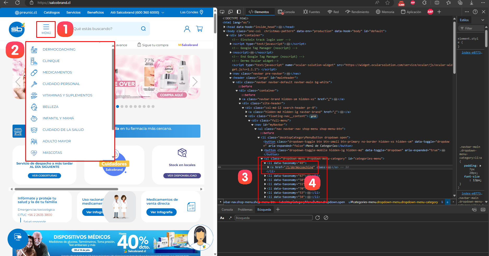
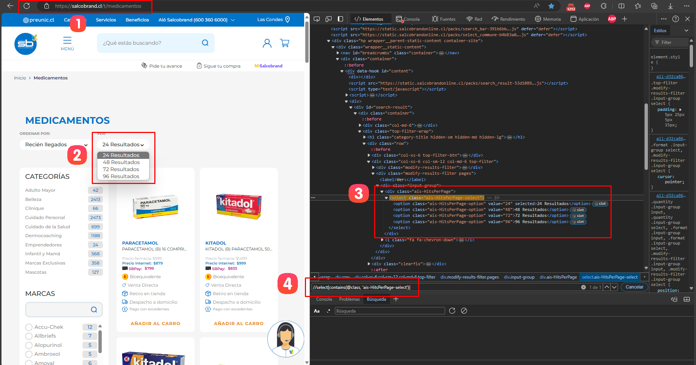
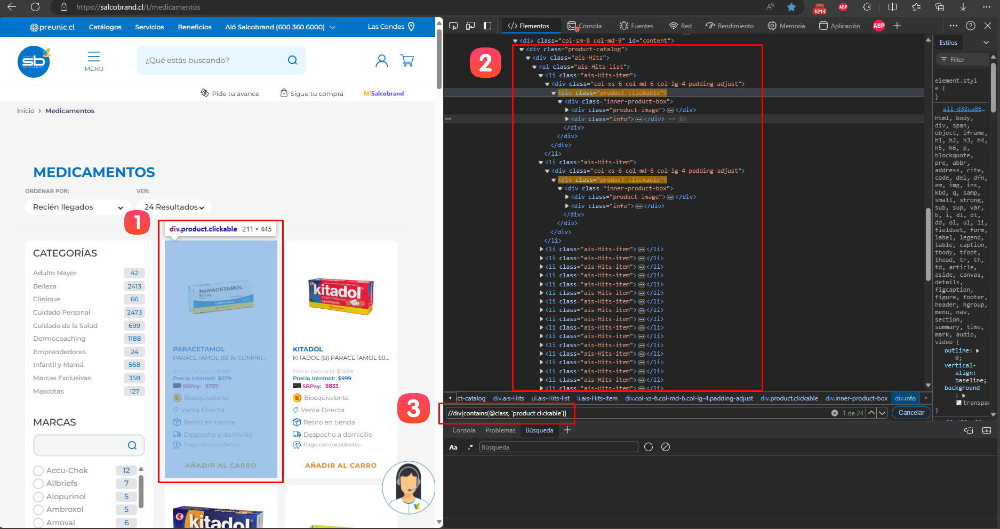
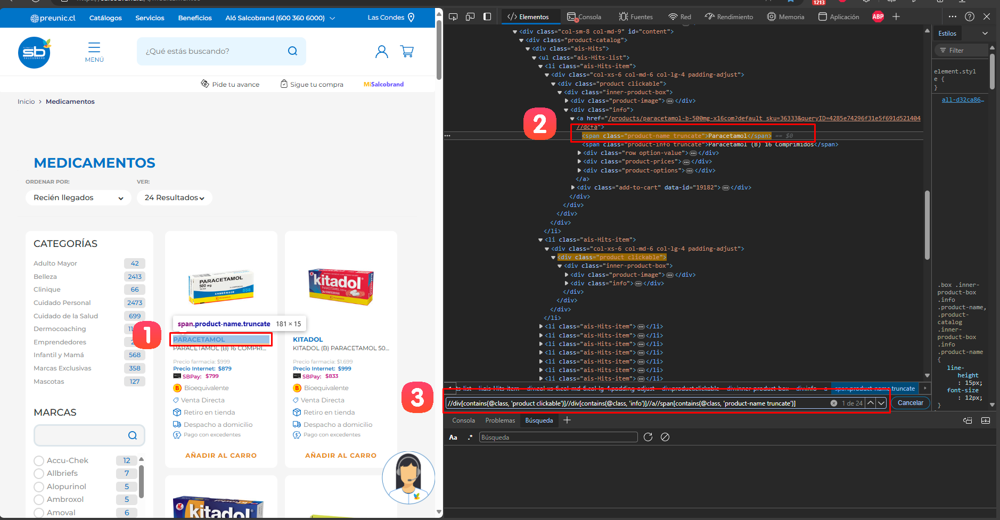
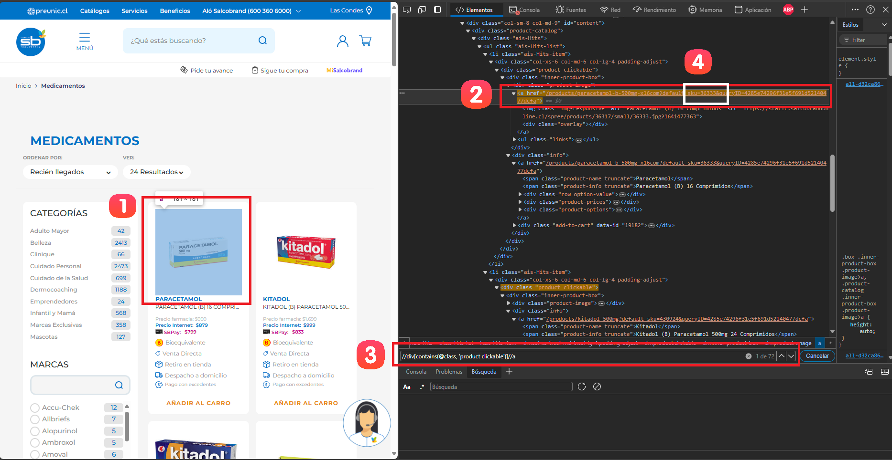
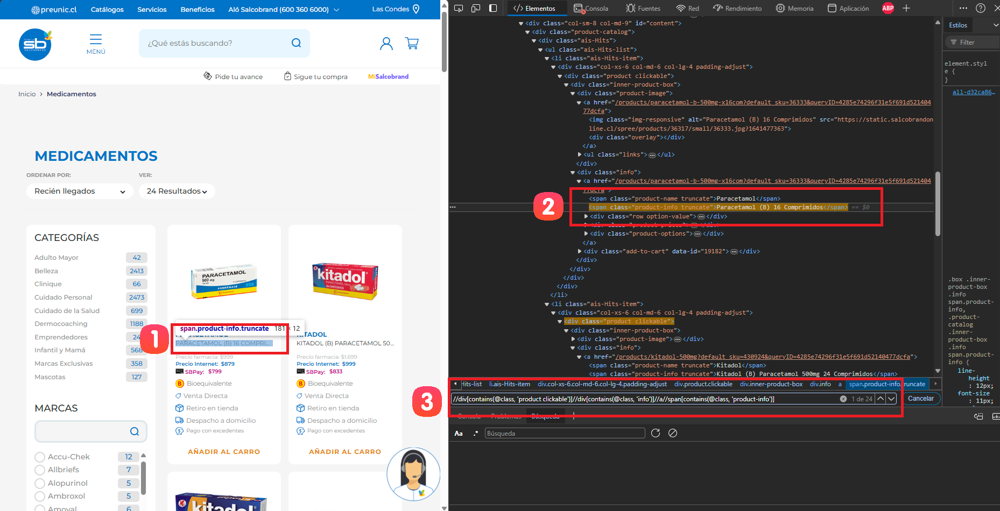
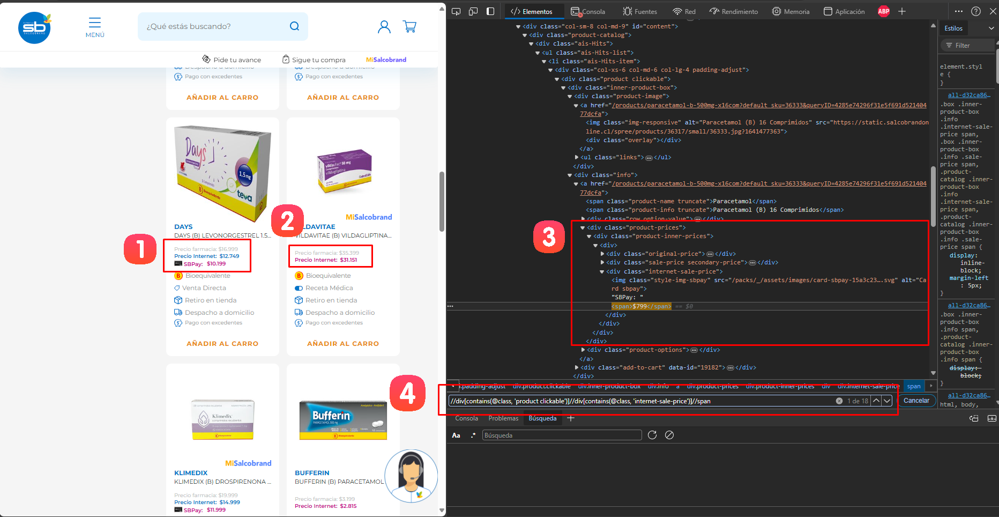
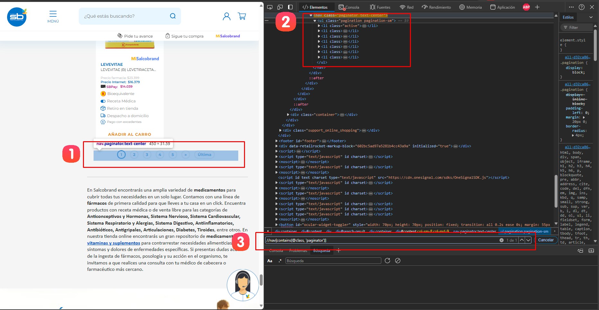

# Documentación del Spider de Salcobrand

## Resumen
Este spider está diseñado para extraer información de productos del sitio web de Salcobrand (salcobrand.cl). Utiliza Scrapy y Selenium para navegar por el sitio, manejar contenido dinámico y extraer datos de los productos en diferentes categorías.

## Guía de Configuración Inicial

### Paso 0: Acceder al sitio web de Salcobrand
1. Abrir navegador web.
2. Visitar la página principal de Salcobrand: https://salcobrand.cl

### Paso 1: Selección y Extracción de Categorías



1. **Acceder al menú principal**: Haz clic en el botón "MENÚ" en la parte superior izquierda de la página principal de Salcobrand.

2. **Despliegue del menú de categorías**: Se desplegará un popup que muestra las diferentes categorías de productos disponibles.

3. **Inspeccionar el elemento**: Utiliza las herramientas de desarrollo del navegador (presiona F12 o clic derecho > Inspeccionar) y localiza el elemento HTML que contiene la lista de categorías.

4. **Identificar los elementos de categoría**: En el DOM o estructura HTML, busca los elementos `<li>` que contienen los datos de cada categoría. Estos elementos generalmente tienen un atributo `data-taxonomy` con un valor numérico y un atributo `class` que incluye "desktop-category-menuButton".

5. **Extraer los strings de las categorías**: Para cada elemento `<li>` relevante, extrae el texto dentro del elemento `<a>`. Este será el string que utilizaremos para configurar el spider.

### Paso 2: Configuración del Spider con las Categorías Extraídas

Una vez que hayas extraído los strings de las categorías, actualiza la lista `self.categories` en el método `__init__` del spider:

```python
def __init__(self, *args, **kwargs):
    super().__init__(*args, **kwargs)
    chrome_options = Options()
    chrome_options.add_argument("--headless")
    service = Service(ChromeDriverManager().install())
    self.driver = webdriver.Chrome(service=service, options=chrome_options)
    self.categories = [
        'adulto-mayor',
        'vitaminas-y-suplementos',
        'medicamentos',
        'dermocoaching',
        'clinique',
        'cuidado-personal',
        'infantil-y-mama',
        'cuidado-de-la-salud',
        'mascotas'            
    ]
```

Asegúrate de que los strings en `self.categories` coincidan exactamente con los textos extraídos de los elementos `<a>` en el menú de categorías del sitio web. Estos strings se utilizarán para construir las URLs que el spider visitará para extraer los productos.

## Paso 3: Iniciando el Proceso de Scraping
El spider comienza visitando la página principal de Salcobrand y luego itera sobre las categorías predefinidas.

```python
def parse(self, response):
    self.driver.get(response.url)
    base_url = 'https://salcobrand.cl/t/'

    for category in self.categories:
        url = f"{base_url}{category}"
        self.driver.get(url)
        time.sleep(5)  # Wait for JavaScript to load contents
        
        # Selecciona el máximo número de resultados por página
        self.select_max_results_per_page()
```

## Paso 4: Selección del Máximo Número de Resultados por Página

Para optimizar el proceso de scraping, el spider implementa una función para seleccionar el máximo número de resultados por página. A continuación, se detalla el proceso para identificar y seleccionar esta opción:



1. **Acceder a una categoría**: Navega a una categoría específica del sitio web de Salcobrand. En este ejemplo, se ha accedido a la categoría "Medicamentos" (https://salcobrand.cl/t/medicamentos).

2. **Localizar el selector de resultados por página**: En la página de la categoría, busca el menú desplegable que permite seleccionar el número de resultados por página. Generalmente, se encuentra en la parte superior de la lista de productos y ofrece opciones como 24, 48, 72 y 96 resultados.

3. **Inspeccionar el elemento**: Haz clic derecho sobre el selector y elige "Inspeccionar" en el menú contextual. Esto abrirá las herramientas de desarrollo del navegador.

4. **Analizar la estructura HTML**: En el panel de herramientas de desarrollo, localiza el elemento `<select>` que contiene las opciones de número de resultados. Observa su estructura y atributos.

5. **Identificar el XPath**: Basándote en la estructura HTML, determina el XPath que permitirá seleccionar este elemento específico. En este caso, el XPath podría ser similar a:
   ```
   //select[contains(@class, 'ais-HitsPerPage-select')]
   ```

Ahora, actualizaremos la función `select_max_results_per_page()` en el spider para utilizar este XPath y seleccionar el máximo número de resultados:

```python
def select_max_results_per_page(self):
    try:
        # Espera a que el elemento select esté presente
        select_element = WebDriverWait(self.driver, 10).until(
            EC.presence_of_element_located((By.XPATH, "//select[contains(@class, 'ais-HitsPerPage-select')]"))
        )
        
        # Crea un objeto Select
        select = Select(select_element)
        
        # Selecciona la última opción (que debería ser el máximo número de resultados)
        select.select_by_index(len(select.options) - 1)
        
        # Espera a que la página se actualice
        time.sleep(5)
        
        print("Seleccionado el máximo número de resultados por página.")
    except Exception as e:
        print(f"Error al seleccionar el máximo número de resultados por página: {str(e)}")
```

Esta función realiza las siguientes acciones:
1. Espera hasta 10 segundos para que el elemento `select` esté presente en la página.
2. Crea un objeto `Select` de Selenium para manejar el menú desplegable.
3. Selecciona la última opción del menú, que generalmente corresponde al máximo número de resultados por página.
4. Espera 5 segundos para que la página se actualice con la nueva selección.

Al implementar esta función, el spider podrá maximizar el número de productos que extrae en cada petición, reduciendo el número total de páginas que necesita visitar y optimizando así el proceso de scraping.

## Paso 5: Extracción de Datos de Productos

Para extraer la información de cada producto en la página de categoría, el spider utiliza un proceso específico para identificar y seleccionar los elementos de producto. A continuación, se detalla este proceso:



1. **Inspeccionar el elemento de producto**: En la página de categoría, haz clic derecho sobre un producto y selecciona "Inspeccionar" para abrir las herramientas de desarrollo del navegador.

2. **Explorar la estructura del DOM**: En el panel de herramientas de desarrollo, identifica la estructura HTML que contiene la información de cada producto. Busca un elemento contenedor que se repita para cada producto en la lista.

3. **Identificar el XPath**: Basándote en la estructura HTML, determina el XPath que permitirá seleccionar todos los elementos de producto en la página. En este caso, el XPath es:
   ```
   //div[contains(@class, 'product clickable')]
   ```

Ahora, actualizaremos la función de extracción de productos en el spider para utilizar este XPath:

```python
def parse_category(self, response):
    products = self.driver.find_elements(By.XPATH, "//div[contains(@class, 'product clickable')]")

    if not products:
        print(f"No products found for category {response.meta['category']}, breaking the loop.")
        return

    for product in products:
        loader = ItemLoader(item=ScrPharmaItem(), selector=product)
        brand, product_url, product_name, price, price_sale, price_benef, sku = self.extract_product_details(product)
        loader.add_value('brand', brand)
        loader.add_value('url', product_url)
        loader.add_value('name', product_name)
        loader.add_value('price', price)
        loader.add_value('price_sale', price_sale)
        loader.add_value('price_benef', price_benef)
        loader.add_value('code', sku)
        loader.add_value('category', response.meta['category'])
        loader.add_value('timestamp', datetime.now())
        loader.add_value('spider_name', self.name)
        yield loader.load_item()
```

Esta función realiza las siguientes acciones:
1. Utiliza el XPath para encontrar todos los elementos de producto en la página.
2. Para cada producto encontrado, crea un `ItemLoader` con el item `ScrPharmaItem`.
3. Llama a la función `extract_product_details` (que se explica más adelante) para obtener los detalles específicos del producto.
4. Añade los valores extraídos al `ItemLoader`, que aplicará las funciones de procesamiento definidas en `items.py`.
5. Yield del item cargado para su posterior procesamiento en el pipeline.

Los detalles sobre el funcionamiento del `ItemLoader`, las funciones de procesamiento y el pipeline se encuentran en el documento adjunto "item_pipeline_documentation.md".

## Paso 6: Extracción de Detalles del Producto

En esta sección, explicaremos en detalle cómo se extraen los diferentes campos de información para cada producto utilizando XPath.

### Extracción de la Marca (Brand)



1. **Identificar el elemento de marca**: Localiza visualmente dónde aparece la marca del producto en la página.

2. **Analizar la estructura del DOM**: En las herramientas de desarrollo, identifica el elemento HTML que contiene la marca.

3. **Construir el XPath**: El XPath para la marca es una concatenación del XPath del producto más el XPath específico de la marca:

   ```python
   brand_xpath = ".//div[contains(@class, 'info')]//a//span[contains(@class, 'product-name truncate')]"
   brand = product.find_element(By.XPATH, brand_xpath).text
   ```

### Extracción de la URL del Producto y SKU



1. **Identificar el elemento de URL**: Localiza el elemento que contiene el enlace al producto.

2. **Explorar la estructura HTML**: Observa que el elemento `<a>` contiene el atributo `href` con la URL del producto.

3. **Construir el XPath para la URL**:

   ```python
   url_xpath = ".//a"
   product_url = product.find_element(By.XPATH, url_xpath).get_attribute('href')
   ```

4. **Extraer el SKU de la URL**:

   ```python
   parsed_url = urllib.parse.urlparse(product_url)
   params = urllib.parse.parse_qs(parsed_url.query)
   sku = params.get('default_sku', [''])[0]
   ```

### Extracción del Nombre del Producto



1. **Identificar el elemento del nombre**: Localiza visualmente el nombre del producto.

2. **Analizar la estructura del DOM**: Identifica el elemento HTML que contiene el nombre.

3. **Construir el XPath**:

   ```python
   name_xpath = ".//div[contains(@class, 'info')]//a//span[contains(@class, 'product-info')]"
   product_name = product.find_element(By.XPATH, name_xpath).text
   ```

### Extracción de Precios

La extracción de precios en Salcobrand maneja diferentes escenarios dependiendo de los tipos de precios disponibles para cada producto. A continuación, se detalla el proceso de extracción corregido:



#### Implementación en el Código

El código actual maneja directamente los diferentes escenarios de precios sin utilizar una función auxiliar:

```python
def extract_product_details(self, product):
    # ... (código anterior para otros detalles)

    # Extracción de precio beneficio (SBPay)
    try:
        price_benef = product.find_element(By.XPATH, ".//div[contains(@class, 'info')]//a//div[contains(@class, 'product-prices')]//div[contains(@class, 'internet-sale-price')]//span").text
    except NoSuchElementException:
        price_benef = '0'
    
    if price_benef != '0':
        # Escenario con precio beneficio
        try:
            price_sale = product.find_element(By.XPATH, ".//div[contains(@class, 'info')]//a//div[contains(@class, 'product-prices')]//div[contains(@class, 'sale-price secondary-price')]//span").text
        except NoSuchElementException:
            price_sale = '0'
        try:
            price = product.find_element(By.XPATH, ".//div[contains(@class, 'info')]//a//div[contains(@class, 'product-prices')]//div[contains(@class, 'original-price')]//span").text
        except NoSuchElementException:
            price = '0'
    else:
        # Escenario sin precio beneficio
        try:
            price_sale = product.find_element(By.XPATH, ".//div[contains(@class, 'info')]//a//div[contains(@class, 'product-prices')]//div[contains(@class, 'sale-price')]//span").text
        except NoSuchElementException:
            price_sale = '0'
        if price_sale == '0':
            # Solo hay un tipo de precio
            try:
                price = product.find_element(By.XPATH, ".//div[contains(@class, 'info')]//a//div[contains(@class, 'product-prices')]//div[contains(@class, 'sale-price')]//span").text
            except NoSuchElementException:
                price = '0'
        else:
            # Hay precio de venta y precio regular
            try:
                price = product.find_element(By.XPATH, ".//div[contains(@class, 'info')]//a//div[contains(@class, 'product-prices')]//div[contains(@class, 'original-price')]//span").text
            except NoSuchElementException:
                price = '0'

    return brand, product_url, product_name, price, price_sale, price_benef, sku
```

Esta implementación maneja los siguientes escenarios:

1. **Precio Beneficio (SBPay)**:
   - Se intenta extraer primero. Si no se encuentra, se establece como '0'.

2. **Si existe Precio Beneficio**:
   - Se busca el precio de venta (internet) y el precio original (farmacia).
   - Si alguno no se encuentra, se establece como '0'.

3. **Si no existe Precio Beneficio**:
   - Se busca el precio de venta (internet).
   - Si no se encuentra precio de venta, se busca un único precio.
   - Si se encuentra precio de venta, se busca también el precio original (farmacia).

#### Explicación de los XPaths

- Precio Beneficio: 
  ```xpath
  .//div[contains(@class, 'info')]//a//div[contains(@class, 'product-prices')]//div[contains(@class, 'internet-sale-price')]//span
  ```

- Precio de Venta (con beneficio): 
  ```xpath
  .//div[contains(@class, 'info')]//a//div[contains(@class, 'product-prices')]//div[contains(@class, 'sale-price secondary-price')]//span
  ```

- Precio Original: 
  ```xpath
  .//div[contains(@class, 'info')]//a//div[contains(@class, 'product-prices')]//div[contains(@class, 'original-price')]//span
  ```

- Precio de Venta (sin beneficio): 
  ```xpath
  .//div[contains(@class, 'info')]//a//div[contains(@class, 'product-prices')]//div[contains(@class, 'sale-price')]//span
  ```

Este enfoque asegura que el spider pueda manejar eficazmente las variaciones en la presentación de precios en el sitio de Salcobrand, capturando toda la información relevante de precios disponible para cada producto.

Nota: Los precios se extraen como texto y no se realiza ninguna limpieza o conversión en esta etapa. Si se requiere procesar los precios (eliminar símbolos de moneda, convertir a float, etc.), esto debería hacerse en una etapa posterior del pipeline de procesamiento de datos.

### Función Completa de Extracción de Detalles

```python
def extract_product_details(self, product):
    try:
        brand = product.find_element(By.XPATH, ".//div[contains(@class, 'info')]//a//span[contains(@class, 'product-name truncate')]").text
    except NoSuchElementException:
        brand = 'No brand'
    
    try:
        product_url = product.find_element(By.XPATH, ".//a").get_attribute('href')
        product_name = product.find_element(By.XPATH, ".//div[contains(@class, 'info')]//a//span[contains(@class, 'product-info')]").text
        parsed_url = urllib.parse.urlparse(product_url)
        params = urllib.parse.parse_qs(parsed_url.query)
        sku = params.get('default_sku', [''])[0]
        product_url = urllib.parse.urlunparse(parsed_url._replace(query=''))
    except NoSuchElementException:
        product_url = 'No URL'
        product_name = 'No name'
        sku = 'No SKU'
    
    price_benef = self.extract_price(product, ".//div[contains(@class, 'internet-sale-price')]//span")
    if price_benef != '0':
        price_sale = self.extract_price(product, ".//div[contains(@class, 'sale-price secondary-price')]//span")
        price = self.extract_price(product, ".//div[contains(@class, 'original-price')]//span")
    else:
        price_sale = self.extract_price(product, ".//div[contains(@class, 'sale-price')]//span")
        if price_sale == '0':
            price = self.extract_price(product, ".//div[contains(@class, 'sale-price')]//span")
        else:
            price = self.extract_price(product, ".//div[contains(@class, 'original-price')]//span")

    return brand, product_url, product_name, price, price_sale, price_benef, sku
```

Esta función combina todos los XPaths y lógica de extracción para obtener los detalles completos de cada producto. Se manejan excepciones para asegurar que el spider continúe funcionando incluso si ciertos elementos no están presentes en algunos productos.

## Paso 7: Navegación y Paginación

La navegación a través de múltiples páginas de resultados es crucial para extraer todos los productos de una categoría. El proceso de paginación en Salcobrand se realiza de la siguiente manera:



### 1. Inspeccionar el Elemento de Paginación

Primero, identificamos visualmente el elemento de paginación en la página web y lo inspeccionamos utilizando las herramientas de desarrollo del navegador.

### 2. Identificar la Estructura HTML del DOM

Al analizar la estructura HTML, notamos que la paginación está implementada como una lista no ordenada (`<ul>`), donde cada elemento de la lista (`<li>`) representa una página. La página actual está marcada con una clase "active".

### 3. Construir la Lógica de Iteración

Basándonos en esta estructura, implementamos la lógica para navegar a la siguiente página:
- Identificamos el elemento `<li>` con la clase "active".
- Buscamos el siguiente elemento `<li>` hermano.
- Si existe, hacemos clic en él para ir a la siguiente página.
- Si no existe un siguiente elemento, hemos llegado al final de la paginación.

### Implementación en el Código

Aquí está la implementación actualizada de las funciones de paginación:

```python
def scroll_to_pagination(self):
    try:
        pagination_element = self.driver.find_element(By.XPATH, "//nav[contains(@class, 'paginator')]")
        self.driver.execute_script("arguments[0].scrollIntoView(true);", pagination_element)
        WebDriverWait(self.driver, 10).until(
            EC.visibility_of(pagination_element)
        )
    except NoSuchElementException:
        print("Pagination element not found, maybe it's a single page without pagination.")
    except TimeoutException:
        print("Pagination element not visible after 10 seconds.")

def get_next_page_button(self):
    try:
        active_page = self.driver.find_element(By.XPATH, "//nav[contains(@class, 'paginator')]//ul//li[contains(@class, 'active')]")
        next_page = active_page.find_element(By.XPATH, "following-sibling::li[1]//a")
        return next_page
    except NoSuchElementException:
        return None

def navigate_pagination(self):
    while True:
        # Extraer productos de la página actual
        self.extract_products_from_current_page()

        # Intentar navegar a la siguiente página
        self.scroll_to_pagination()
        next_page_button = self.get_next_page_button()
        
        if next_page_button:
            try:
                self.driver.execute_script("arguments[0].click();", next_page_button)
                WebDriverWait(self.driver, 10).until(
                    EC.staleness_of(next_page_button)
                )
                time.sleep(5)  # Esperar a que la nueva página se cargue
            except Exception as e:
                print(f"Error al hacer clic en el botón de siguiente página: {str(e)}")
                break
        else:
            print("No hay más páginas para navegar.")
            break
```

### Explicación del Proceso

1. `scroll_to_pagination()`: Esta función se encarga de desplazar la página hasta que el elemento de paginación sea visible. Esto es necesario porque algunos sitios web cargan la paginación dinámicamente cuando se llega al final de la página.

2. `get_next_page_button()`: Esta función localiza el botón de la siguiente página. Primero encuentra el elemento `<li>` con la clase "active" (página actual) y luego busca el siguiente elemento `<li>` hermano que contiene el enlace a la siguiente página.

3. `navigate_pagination()`: Esta función maneja el proceso completo de paginación:
   - Extrae los productos de la página actual.
   - Intenta encontrar el botón de la siguiente página.
   - Si lo encuentra, hace clic en él y espera a que la nueva página se cargue.
   - Si no encuentra un botón de siguiente página, asume que ha llegado al final y termina el proceso.

Este enfoque asegura que el spider pueda navegar eficazmente a través de todas las páginas de resultados en una categoría, extrayendo todos los productos disponibles antes de pasar a la siguiente categoría.

## Paso 8: Manejo de Errores y Cierre
El spider incluye manejo de excepciones para lidiar con elementos no encontrados y asegura que el driver de Selenium se cierre correctamente al finalizar.

```python
def closed(self, reason):
    self.driver.quit()
```

## Notas Adicionales
- El spider utiliza `urllib.parse` para manejar y limpiar las URLs de los productos.
- Se implementa una función separada (`extract_price`) para manejar la extracción de diferentes tipos de precios, lo que hace el código más limpio y mantenible.
- El spider maneja diferentes casos de precios (precio normal, precio de venta, precio de beneficio) para asegurar la extracción de la información correcta.
- Se utiliza `WebDriverWait` para esperar que ciertos elementos estén visibles antes de interactuar con ellos, lo que mejora la robustez del spider.
- La paginación se maneja de manera dinámica, detectando la presencia del botón de siguiente página y haciendo clic en él cuando está disponible.
- El spider está diseñado para ser robusto frente a cambios en la estructura de la página, utilizando múltiples métodos para intentar extraer cada pieza de información.
